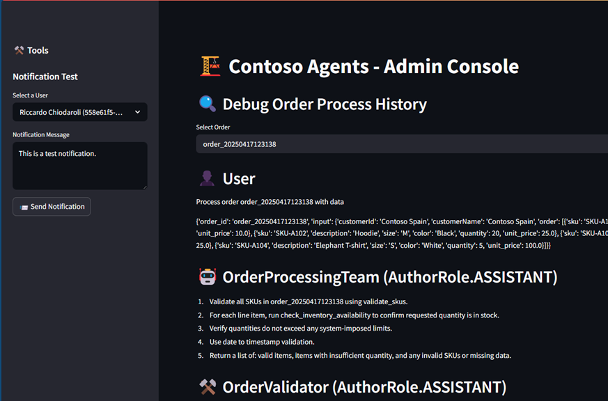

# Contoso Agents

This is sample application for the Contoso Agents project, which demonstrates how to build autonomous agents that can process incoming orders via email. The agents are designed to work with Microsoft Copilot Studio and Microsoft Teams, allowing users to review and approve orders through a user-friendly interface.

## Features

- Autonomous agents process incoming orders via email and notify users in Microsoft Teams of the eventual outcome
- User can the review and approve orders interacting with the agents over Copilot Studio or Teams

<figure>
    <div align="center">
        
        <figcaption><em>Admin console showing behind-the-scene order processing (no human in the loop)</em></figcaption>
    </div>
</figure>

<figure>
    <div align="center">
        
        <figcaption><em>User chatting with agents afterwards in Teams</em></figcaption>
    </div>
</figure>

## Technical overview

If you are interested in the technical details of the project, a comprehensive overview of the architecture and design decisions can be found in the [Technical Overview](docs/technical_overview.md) document.

## Getting Started

### 0. Prerequisites

- Python 3.12 or later
- Azure Deverloper CLI

### 1. Azure deployment

> [!IMPORTANT]
> In order to start the deployment, you must first create an Entra ID App Registration with a client secret.
> This is required for the Azure Bot Service to work.

> [!TIP]
> You can create the Entra ID App Registration using the Azure CLI with the following command:

```bash
az ad app create --display-name "Contoso Agents Bot"
az ad app credential reset --id [app-id from previous command]
```

Now you can start the deployment:

1. `git clone https://github.com/Azure-Samples/contoso-agents`
2. `cd contoso-agents`
3. `azd up`

> [!IMPORTANT]
> When prompted, input `botAppId`, `botAppPassword`, and `botAppTenantId` with the values from the Entra ID App Registration you created earlier.
>
> Additionally, you must also provide `openAIName` and `openAIResourceGroupName` of an existing OpenAI resource in your Azure subscription. Standard required deployments are `gpt-4.1-mini` and `o4-mini`, values can be changed in `infra/main.bicep`.

> [!NOTE]
> The deployment process will take several minutes to complete. The script will also run some post-provisioning tasks:
>
> - Update App Registration with the correct homepage URL (as required by Copilot Studio)
> - Seed the database with some sample data

### 2. Installing the Teams app

1. Get the `TEAMS_MANIFEST_URL` value from `azd env get-value TEAMS_MANIFEST_URL`.
1. Download the Teams app manifest from `TEAMS_MANIFEST_URL`.
1. Open the Teams app and go to the Apps section on the left sidebar.
1. Click "Manage your apps" at the bottom of the sidebar.
1. Click "Upload a custom app" at the bottom of the page and select the downloaded manifest file.
1. Click "Add" to install the app.

### 3. Setting up the email inbox connection

By default the `office365` connection is not connected to any mailbox. You can connect it to your own mailbox or any other one you have access to.
To do this, follow these steps:

1. Open the Azure portal and navigate to the resource group.
2. Open the `office365` connection.
3. You should see an error banner indicating that the connection is not connected. Click it and follow the instructions to connect it to your mailbox.

> [!TIP]
> You can also use an `outlook` connection instead of `office365`. To do this, you need to create a new connection in the Azure portal and update the LogicApps to use the new connection.

> [!NOTE]
> Remember that changes made directly in the Azure portal will be lost when you run `azd up` again. To make changes permanent, you need to update the Bicep files in the `infra` folder and run `azd up` again.

### 4. Submitting orders

You can submit orders to the agents either by sending an email to the address you associated in the LogicApp or by uploading a file in the `inbox` blob container.

The agents will process the order and notify you of the outcome via Microsoft Teams. You can also review and approve the order through the Admin app.

## Running locally

Part of this application can be run locally for development purposes. To do this, you need to set up a local environment and install the required dependencies.

> [!NOTE]
> The local environment is not a complete replica of the Azure environment, especially regarding Teams apps. However, you can run the `skill` app locally and use DevTunnel to expose it to the internet. For more details, see [DevTunnels documentation](https://learn.microsoft.com/en-us/azure/developer/dev-tunnels/get-started?tabs=windows).
>
> Then, update the Azure Bot `messagingEndpoint` with the provided URL to test the skill locally.

1. Create a virtual environment and activate it:

```bash
python -m venv .venv
source .venv/bin/activate  # On Windows use .venv\Scripts\activate
```

2. Install the required dependencies:

```bash
pip install -r src/agents/requirements.txt
pip install -r src/admin/requirements.txt
pip install -r src/skill/requirements.txt
```

3. Set up `.env` file with the required environment variables. You can use the `.env.example` file as a reference.

> [!TIP]
> After you deploy the application, you can find the required environment variables under `.azure/<env name>/.env`.
>
> You can copy those values to your local `.env` file.

## Contributing

Please read the [Contributing Guide](CONTRIBUTING.md) for details on our code of conduct, and the process for submitting pull requests to us.

## License

This project is licensed under the MIT License - see the [LICENSE](LICENSE) file for details.
