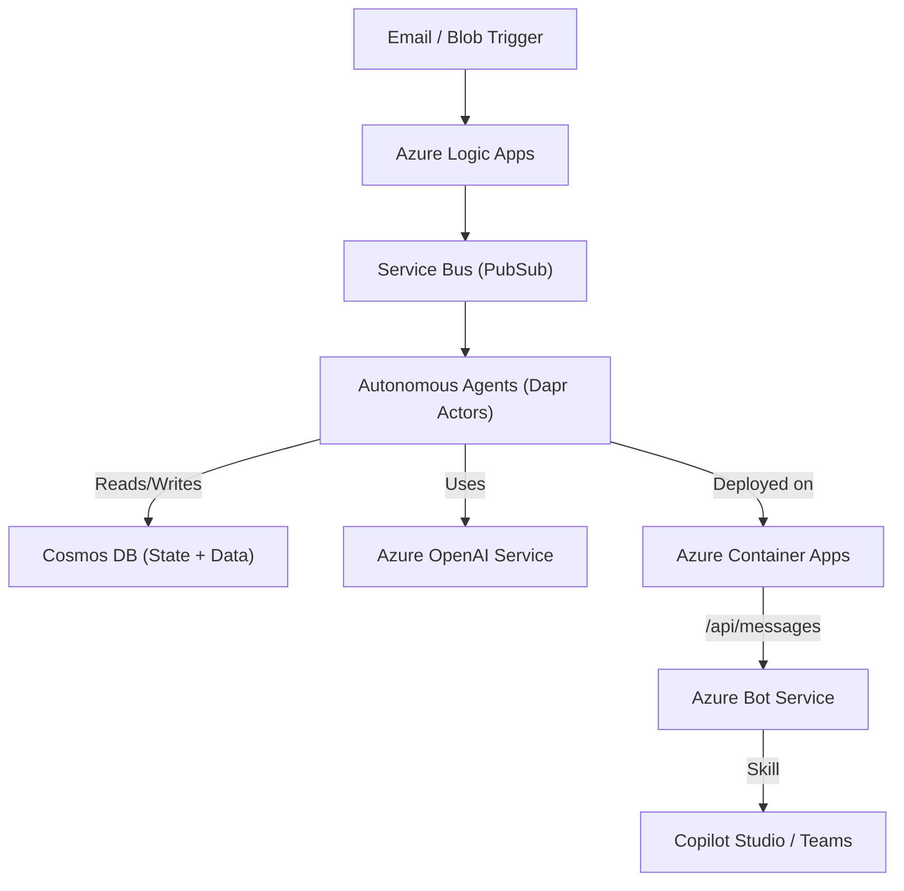

# Technical Overview of Contoso Agents

The Contoso Agents repository implements an autonomous order processing system leveraging Azure services, Semantic Kernel, and AI-driven agents. It automates order handling, validation, substitution, pricing, and fulfillment, providing a comprehensive audit trail and user interaction via Copilot Studio or Microsoft Teams.

## Architecture Overview

The architecture follows a modular, event-driven approach leveraging Azure services and Dapr for state management and communication:

The architecture follows an event-driven, microservices-based approach:

- **Event Triggers**: Orders are initiated via email or blob storage events, processed by Azure Logic Apps.
- **Pub/Sub Messaging**: Azure Service Bus (via Dapr) facilitates communication between Logic Apps and autonomous agents.
- **Autonomous Agents**: Each agent performs specialized tasks (validation, substitution, pricing, fulfillment, review) using Azure OpenAI models for intelligent decision-making.
- **Data Persistence**: Cosmos DB stores state and order data, accessed via Dapr state management.
- **User Interaction**: Users interact with the system through Copilot Studio or Microsoft Teams, facilitated by Azure Bot Service.

## Main Components

### Autonomous Agents (`src/agents`)

Located in the `agents` directory, these agents handle specific tasks in the order processing workflow:

- **Validator Agent** (`validator_agent.py`): Validates orders against inventory and business rules.
- **Substitution Agent** (`substitution_agent.py`): Checks inventory availability and suggests product substitutions.
- **Pricing Agent** (`price_agent.py`): Applies pricing rules, discounts, and customer-specific pricing.
- **Fulfillment Agent** (`fulfillment_agent.py`): Finalizes orders, schedules deliveries, and allocates inventory from optimal facilities.
- **Reviewer Agent** (`reviewer_agent.py`): Performs final quality checks, ensuring compliance with business rules and documenting any exceptions.

> [!IMPORTANT]
> These agents are actually **doubled**, since they're behavior must change depending on the context of the interaction (unattended or attended). This is done by using two different orchestrators and slightly different implementations of the same agent. The two teams are:
>
> - `processing_team` using a `PlannedTeam` orchestrator and agents under `order/processing` subfolder handle the entire order processing workflow and can iterate over providing feedback to the other agents. This is exposed as a Dapr actor called `ProcessingActor` (`src/agents/actors/processing_actor.py`), which is the main entry point for order processing.
> - `assistant_team` using a `Team` orchestrator and agents under `order/chat` subfolder instead use a _speaker election_ approach to determine which agent should be the next to support the user in a human-in-the-loop scenario. This is exposed as a Dapr actor called `UserActor` (`src/agents/actors/user_actor.py`), which is the main entry point for user interaction. This team is used when the user interacts with the system via Copilot Studio or Microsoft Teams.

Either way, both teams are implemented as Dapr actors, which allows them to be deployed as microservices in Azure Container Apps and manage conversation state natively.

### User Interaction (`src/skill`)

Human-in-the-loop interaction is facilitated through the `skill` directory, which contains the **Azure Bot Service skill** implementation and integration with Copilot Studio and Microsoft Teams.

> [!NOTE]
> It is key to note human-in-the-loop interaction is not expected at first, since the initial processing is fully autonomous. HIL is only used for review and exception handling.

This skill always uses the `assistant_team` agent, proxied via `UserActor`, which allows the user to interact with the agents in a conversational manner and persist history as agent state.

> [!NOTE]
> In order to properly format messages in chat, the skill always converts outputs from the agents to a `AdaptiveCard` object, which is then rendered in the chat.

Additionally, when installed in Teams the skill handles specific `installationUpdate` events to register the user in the system and create a `UserActor` for them - this will be used to notify the user of any new order.

### Admin dashboard (`src/admin`)

A basic Streamlit application is provided in the `admin` directory for monitoring order processing and test user notifications.

### Data Storage

The application uses Azure Cosmos DB for persistent storage, both for order data and conversation state.

- **Conversation state** consist of the Semantic Kernel `ChatHistory` generated by agents, and is managed using Dapr's Actor State capabilities, allowing agents to maintain context across interactions, partitioning by either order ID (for order processing) or user ID (for chatting).
- **Order data** consists of orders, SKU, customers pricesheet, facilities and is stored in a structured JSON format, partitioned by entity type for efficient querying and retrieval. These are primarily used by agents tool calls to retrieve and write data from/to the database.

> [!NOTE]
> Dapr offers a powerful state management API that abstracts the underlying data store, but the Query API is still in alpha stage and not used in this project. Instead, the application uses the Cosmos DB API directly for querying.

### Azure Infrastructure

Defined in the infra directory using Bicep templates:

- **Azure Container Apps (ACA)** (`aca.bicep`): Hosts the agents, skill, and admin applications.
- **Azure Container Registry (ACR)** (`acr.bicep`): Stores container images.
- **Azure Cognitive Services (OpenAI)** (`openAI.bicep`): Provides AI models for agent decision-making.
- **Azure Logic Apps** (`logicapp.bicep`): Automates workflows triggered by emails and blob storage events.
- **Azure Application Insights** (`appin.bicep`): Monitors application performance and logs.

## End-to-end telemetry

The application uses Azure **Application Insights** for telemetry and monitoring, enabling full end-to-end tracking of order processing and user interactions.

> [!NOTE]
> Standard telemetry is automatically collected by the Azure SDKs (via `configure_azure_monitor` function), but additional handling is done for:
>
> - **Dapr Actors**: by default, Dapr actors call do not support OpenTelemetry, so we add this manually in `src/agents/app.py` and `src/skill/app.py`
> - **Semantic Kernel customizations**: we add custom telemetry for `Team` and `PlannedTeam` orchestrators, as well as for `SpeakerElection` and `PlanningStrategy` classes, to track the decision-making process and agent interactions.
